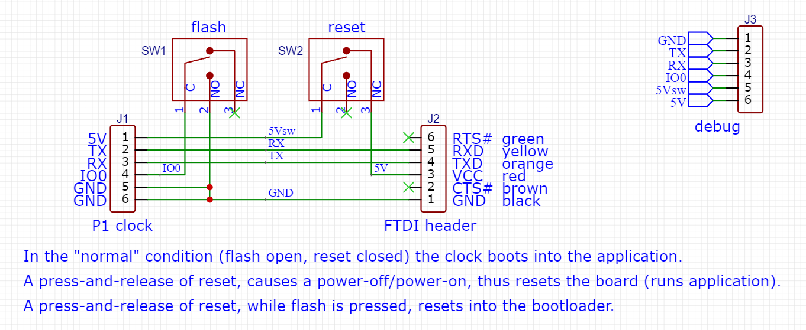
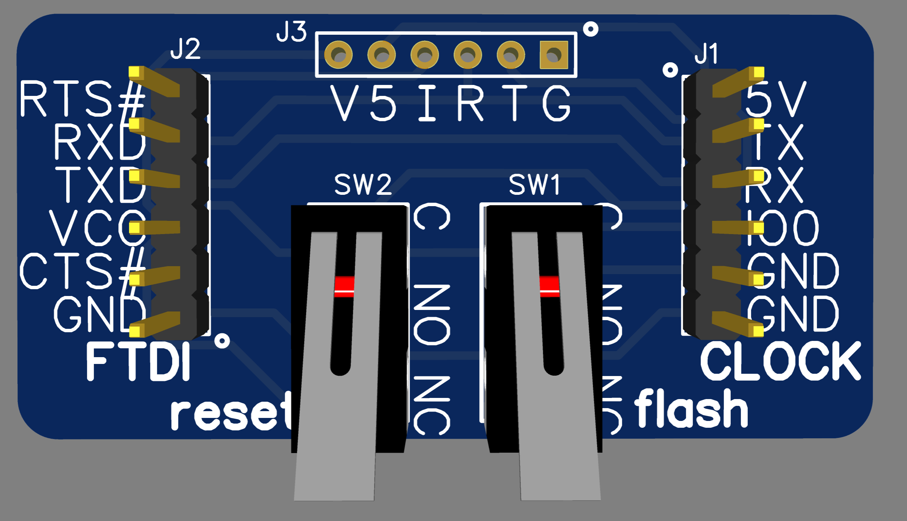

# Flashing my firmware


## Introduction

After having made a backup of the original firmware, and the analysis of the connections
between the key components, I decided to take the plunge: flash my of firmware.


## Hardware

The board is missing a reset button. S1 is the "flash" button, but it is a bit hard to press.
I made the following programming adapter:



and an official board



but I can't wait that long, so I hand soldered one.


The pin-header on the right-hand-side has the pins a little bent so that it force-fits.


## Software

My first goal is to see if we can flash the ESP8266.
I felt confident enough to run three tests in one go: serial, led and the three buttons.
It is available as [arduino sketch](clocktest).

The pins come form the [analyses we did earlier](../pcbnets#gpio-nets), copying the findings:
 - GPIO2 outputs LED D1 (low active)
 - GPIO0 inputs switch S1 (low active) also to P1.IO0
 - GPIO4 inputs switch S2 (low active)
 - GPIO15 inputs switch S3 (high active)


```C
// clocktest.ino - tests the LED and switches on the board
// board: Generic ESP8266 module

#define D1_PIN 2

#define S1_PIN 0
#define S2_PIN 4
#define S3_PIN 15

#define getS1() (digitalRead(S1_PIN)==0) // low active
#define getS2() (digitalRead(S2_PIN)==0) // low active
#define getS3() (digitalRead(S3_PIN)!=0) // high active

void setup() {
  Serial.begin(115200);
  Serial.printf("\n\nclocktest.ino\n\n");

  // configure LEDs (D1)
  digitalWrite(D1_PIN, HIGH); // low active 
  pinMode(D1_PIN, OUTPUT);

  // Configure switches (S1, S2, S3)
  pinMode(S1_PIN, INPUT_PULLUP );
  pinMode(S2_PIN, INPUT_PULLUP );
  pinMode(S3_PIN, INPUT );
}

int count;
void loop() {
  digitalWrite(D1_PIN, LOW); // low active
  delay(200);
  digitalWrite(D1_PIN, HIGH); // low active 
  delay(800); 
  Serial.printf("%04d %d %d %d\n",count++,getS1(),getS2(),getS3());
}
```

## Flash

The development cycle is a bit clumsy.
 - Once the source is flashable, press the `reset` (power interrupt).
 - With `reset` still pressed, press the `flash` (and keep it pressed).
 - Now release the `reset` but keep `flash` pressed (this boots the ESP8266 in boot loader mode).
 - Now release the `flash`, the bootloader is now waiting for flash instructions.
 - In the Arduino IDE press `Upload`.
 - Once the IDE is done uploading, press and release `reset`.

With our `clocktest` app running, the red LED at the back flashes (200ms on, 800ms off).
It also print to Serial. I pressed the switches one at a time. This is the output. 

```text
clocktest.ino

0000 0 0 0
0001 1 0 0
0002 1 0 0
0003 0 0 0
0004 0 1 0
0005 0 0 0
0006 0 0 0
0007 0 0 1
0008 0 0 1
0009 0 0 0
0010 0 0 0
0011 0 0 0
0012 0 0 0
0013 0 0 0
```


## Display

A very important step is display control.
The [previous analyses](../pcbnets#gpio-nets) gave us this data
 - TM1650 driver for the display
 - GPIO13 is "SDA" for TM1650 (not real I2C)
 - GPIO12 is "SCL" for TM1650 (not real I2C)

The Arduino comes with two. I picked the lightest one (Sketch > Include library):
the _7 segment display driver for TM1650_ by Anatoli Arkhipenko.
It is also on [github](https://github.com/arkhipenko/TM1650).

It appears there is one big issue, the segments are ordered in a funny way,
making the built-in font unusable, see [disptest](disptest).

But I do have full control over all segments, see [video](https://www.youtube.com/watch?v=K6gpgd4KOBo).

Note that the decimal point in the center is replaced by the center colon.
With the display having 6+6 pins (12), and controlling 4 rows and 8 columns (12), a choice had to be made.


(end)
