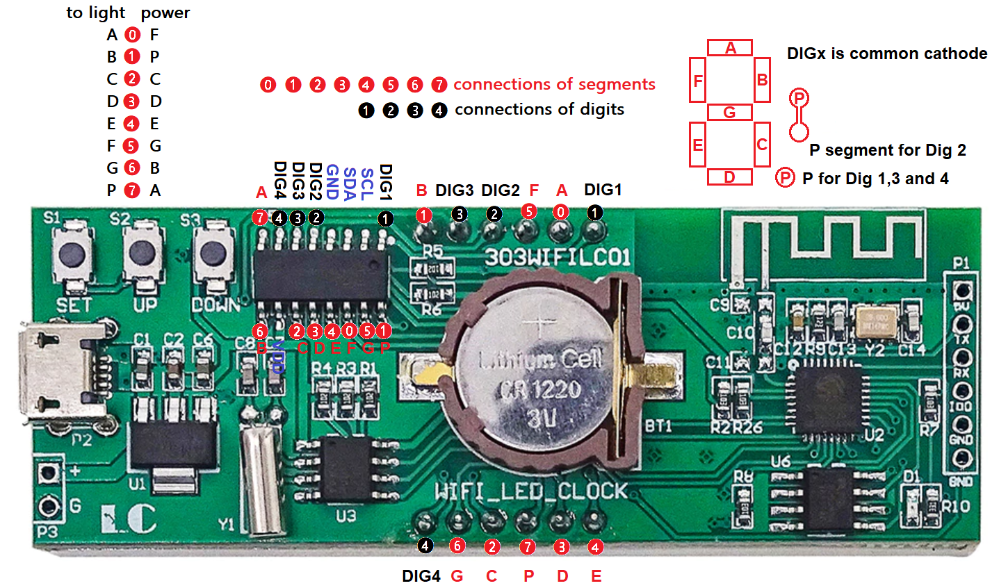
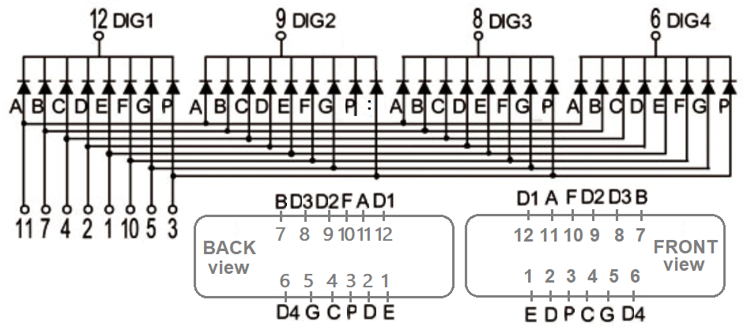
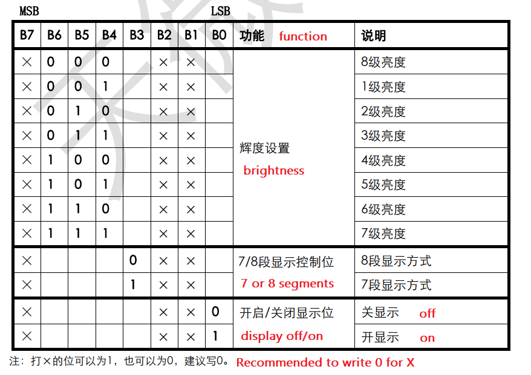

# PCB analysis of the 303WIFILC01 clock

Reverse engineering the display control of the 303WIFILC01 clock.


## TM1650

First, I checked the pinning of the TM1650.
The datasheet is Chinese only (I could only find bot-translated English versions).
However finding the pinout from the [Chinese datasheet](https://datasheet.lcsc.com/lcsc/1810281208_TM-Shenzhen-Titan-Micro-Elec-TM1650_C44444.pdf)
is not hard.

In the photo below, find the DIGx pins of the TM1650 in black.
Those are the common cathode pins of the 4 digits.
In red, find the segment pins A, B, C, D, E, F, G and P (decimal point).
In blue the other connections (power and I2C).




## Display

Above and below the battery, find the pins of the display.
I could not find (a datasheet of) the display.
It has marking `FJ8401AW`; my guess is that
 - `FJ` indicates the manufacturer
 - `8_0` indicates the size: 0.8"
 - `4` indicates number of digits
 - I don't know what the `1` means
 - The `A` means common cathode (a `B` would mean common anode)
 - `W` is for white (O for orange, Y for Yellow, G for green, B for blue and somehow S for red).
For example [ELT5361BY](http://www.yitenuo.com/product/display/three/ELT-5361.html) is
and 0.56 3-digit Yellow  common Anode display from Etnel LED technology.

I believe the internal schematics of the display, and the pinning is as follows.
Note the DIG2 does have a "decimal point", but it is not connected. It is wired to the two dots of the colon.
Again, DIG1, DIG2, DIG3 and DIG4 are the common cathode pins of the four digits.
The segment pins are labeled A, B, C, D, E, F, G and P (decimal point).



I have confirmed this on the 303WIFILC01 board (with a current and voltage limited probe).

The photo in the first section also shows the display pinout, and it has a diagram of the which segment is A-G or P.


## Connection

The TM1650 and the display are made for each other. Both have 4 common cathodes (DIG1..DIG4) and 8 segments (A-G,P).
I would expect that the corresponding pins are connected, **but they are not**.

I probed the TM1650 pins and the display pins to see which is connected to which.
The photo in the first section has that indicated with the black ❶❷❸❹ (digits) and the red ⓿❶❷❸❹❺❻❼ (segments).

We observe that the DIG pins are connected as expected, and also segments CDE but ABFGP are mixed.

 | to light segment | power pin |
 |:----------------:|:---------:|
 |          A       |      F    |
 |          B       |      P    |
 |          C       |      C    |
 |          D       |      D    |
 |          E       |      E    |
 |          F       |      G    |
 |          G       |      B    |
 |          P       |      A    |


## Datasheet

The [Chinese datasheet](https://datasheet.lcsc.com/lcsc/1810281208_TM-Shenzhen-Titan-Micro-Elec-TM1650_C44444.pdf)
gives us the following key points (focus on display; ignoring support for key scan):

 - The device is "semi" I2C. 
   It is I2C in the sense that it has a start and stop, and in between those, bytes are sent. 
   It is not I2C because the device itself has no I2C address, it needs to be on a bus by its own.
   It borrows from I2C that it has registers that the host (ESP8266) should write to,
   and those registers have a (one byte) address.
   
 - There is one generic _control_ register at location 48H (0x48).
   
 - The control register determines whether the display is on or off, and what brightness it has.
   
   

   A write of 0b0101_0001 to 0x48 configures the display to have brightness 5, 8 segments and power On.
   
   Observe that 000 is tagged as brightness 8 - so think of this as (1)000.

   I believe the 7/8 segments settings changes the timing of the digit/segment control 
   (mode 7 has one segment less; P is always on).
   
 - Since the device does not have an address itself, the example transaction
   has the form `START 48 51 STOP`. In Arduino wire API, we need to begin a transaction 
   by passing the device address. We can simply pass the register address instead.
   However, a device address is 7 bits and it is appended with a 0 for write. 
   So we need to send 0x24 instead of 0x48.
   
   ```C++
   Wire.beginTransmission(0x24); // register 0x48
   Wire.write(0x51);
   Wire.endTransmission();
   ```

 - For displaying content there is a _data_ register per digit.
 
 - The data registers (this is overly verbose in the datasheet) for digits 1 to 4
   are at address 0x68, 0x6A, 0x6C and ox6E.

   
   
   This table does show an important property, namely that bits 0, 1, 2, 3, 4, 5, 6, and 7
   map to segments A, B, C, D, E, F, G, respectively P.
   
   In blue I have added what they map to in our 303WIFILC01 board as we learned in the 
   previous section.
 
 - To write a `0` to the display, we need to power segments A, B, C, D, E, and F, so that
   is (blue) bits 0b1111_1100 or 0xF3:

   ```C++
   Wire.beginTransmission(0x34); // register 0x68
   Wire.write(0xF3);
   Wire.endTransmission();
   ```


## Software

To test my understanding of the datasheet and the analysis of the board, I have written 
an Arduino [sketch](dispself). Enter `b`, `m`, or `p` over serial to step the
brightess, mode78, or power of the _control_ register.

The _data_ register is fixed to `01:23.`


(end)
  
