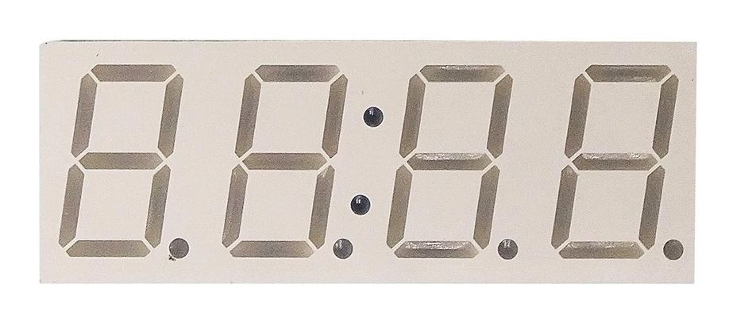

# 303WIFILC01 Clock

Home brew firmware for the ESP8266 based _303 WIFI LC 01 clock_.

## 1. Board analysis

I did a first analysis of the board.
Find my findings in subdirectory [1-pcbnets](1-pcbnets).

## 2. Backup of original firmware

The goals is to make our firmware and flash that on the board.
I made a backup of the original firmware, see subdirectory [2-fwbackup](2-fwbackup), just in case.

This proves that we can communicate with the internal bootloader, so that we can also upload our own firmware.

## 3. Flashing a test

With the backup made, let's see if we can flash our own firmware, see subdirectore
[3-flash](3-flash).

## 4. The display

The firmware illuminated unexpected segments. Time to analyze the display,
see subdirectory [4-display](4-display).

## 5. The new clock firmware

With the board reverse engineered, it is time to write my own firmware.
A basic NTP clock, see subdirectory [5-clock](5-clock).

## 6. Web config

The NTP clock form the previous section already has a configuration option in EEPROM, e.g. for the WiFi AP to connect to.
However, I also want the clock to show whose birthday it is today. Maintaining a list of birthdays via the EEPROM is too clumsy.
So I decided to check if the ESP can read a Google docs spreadsheet. Here is a proof of concept [6-webcfg](6-webcfg).

(end)

